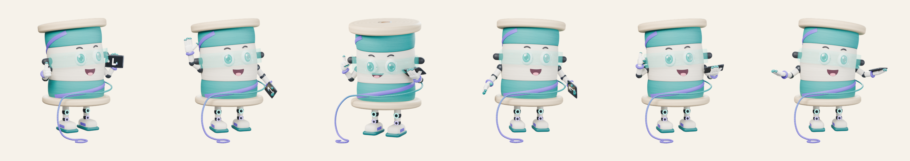

# LOOMY DADA — LoomLab Studio mascot



LOOMY DADA (Loomi) is LoomLab Studio's mascot: an anthropomorphic thread spool
with a holographic visor, robotic arms and legs, and chunky sneakers. It ships as
one rigged, animated glTF 2.0 file that runs straight in the browser
(three.js, `<model-viewer>`, Babylon.js) as well as in Blender, Unity and Unreal.

| File | What it is |
| --- | --- |
| `loomy-dada.glb` | The model: mesh, rig, 7 animations and embedded PBR textures (3.1 MB) |
| `previews/` | Cycles renders (1024 px, transparent background) |
| `build_loomy_dada.py` | Builds the mesh, materials, rig and animations, then exports the GLB |
| `loomy_textures.py` | Procedural 2048 px PBR textures (numpy) |
| `render_previews.py` | Preview renders, and the LoomLab app's stills (`--set app`); studio lights live only in the render scene |

## Model

- **Size / placement:** ~0.97 units (metres) tall, centred on the origin, feet on
  the ground (y = 0), facing **+Z**. Rest pose = A-pose.
- **Mesh:** 33,312 triangles / 17,301 vertices; built as 93% quads, with
  triangles only at the poles of round shapes. All closed parts have outward
  normals; tangents are exported for the normal map.
- **Materials (metal/rough PBR):**
  - `LoomyDada_Atlas`, opaque. 2048×2048 base colour, ORM (R = occlusion,
    G = roughness, B = metallic), OpenGL normal map, and emissive for the
    knee/ankle lights and the tablet logo.
  - `LoomyDada_Visor`, alpha-blended glowing teal hologram with HUD markings.
    2048×2048 base colour (RGBA) + emissive.
  - Uses `KHR_materials_emissive_strength` for the glow.
- **Palette:** teal, violet, cream, light wood and dark grey only.
- **No** background, floor, lights, cameras or baked shadows in the file.
- Khronos glTF Validator: **0 errors, 0 warnings**, max 4 bone influences per vertex.

## Rig (35 bones, humanoid names)

```
Root
└─ Hips
   ├─ Spine
   │  ├─ Head
   │  ├─ LeftShoulder ─ LeftUpperArm ─ LeftLowerArm ─ LeftHand
   │  │     ├─ LeftThumb/Index/Middle/Ring Proximal ─ …Distal
   │  │     └─ LeftHandProp        (the tablet)
   │  └─ RightShoulder ─ RightUpperArm ─ RightLowerArm ─ RightHand
   │        └─ RightThumb/Index/Middle/Ring Proximal ─ …Distal
   ├─ LeftUpperLeg ─ LeftLowerLeg ─ LeftFoot
   └─ RightUpperLeg ─ RightLowerLeg ─ RightFoot
```

The thread body blends `Hips` → `Spine` → `Head` by height. The eyes, brows, visor and top
flange follow `Head`, and the bottom flange follows `Hips`, so a head tilt moves the face
and visor together while the base stays planted. The mouth sits low on the face band, where
the body follows `Spine` more than `Head`, so it takes the body's own weights: on `Head`
alone a look-down pushed it into the body (it vanished in `Processing`).

## Animations (30 fps)

| Clip | Length | Loop | What it does |
| --- | --- | --- | --- |
| `Idle` | 2.4 s | yes | Gentle breathing bob, body sway, small head turn, relaxed arms |
| `Wave` | 1.6 s | yes | Right hand waves beside the head |
| `ThumbsUp` | 1.5 s | no, hold last frame | Right thumbs-up, left hand shows the tablet's "L" logo |
| `Processing` | 2.0 s | yes | Looks down at the tablet, right finger draws circles ("working…") |
| `Think` | 2.4 s | yes | A finger to the visor pod, head tilted, the finger taps ("let me check") |
| `Shrug` | 1.3 s | no, hold last frame | Palms up, head tilted ("oops") |
| `Neutral_APose` | 1 frame | – | The rest A-pose |

The face is part of the mesh (no face rig, no morph targets), so it always smiles in the
GLB. `build_loomy_dada.py --face calm` builds the same character with a small closed mouth
and lifted inner brows: the LoomLab app uses its stills for warnings and errors, where a
grin would read as mockery.

## Use it on the web (three.js)

```js
import * as THREE from 'three';
import { GLTFLoader } from 'three/addons/loaders/GLTFLoader.js';

const clock = new THREE.Clock();
let mixer;
new GLTFLoader().load('loomy-dada.glb', (gltf) => {
  scene.add(gltf.scene);
  mixer = new THREE.AnimationMixer(gltf.scene);
  const clip = (name) => mixer.clipAction(THREE.AnimationClip.findByName(gltf.animations, name));

  clip('Idle').play();

  // one-shot thumbs-up that holds its last frame:
  // const a = clip('ThumbsUp'); a.setLoop(THREE.LoopOnce); a.clampWhenFinished = true; a.play();
});

// in the render loop
mixer?.update(clock.getDelta());
```

Use a light environment (e.g. `RoomEnvironment` + `PMREMGenerator`) so the PBR
materials read correctly. The visor is transparent, so keep
`renderer.sortObjects` on (the default).

Or with no code at all (on a page that may load from a CDN; LoomLab's own app is offline and
bundles three.js instead, see below):

```html
<script type="module" src="https://cdn.jsdelivr.net/npm/@google/model-viewer@3.5.0/dist/model-viewer.min.js"></script>
<model-viewer src="loomy-dada.glb" animation-name="Idle" autoplay camera-controls
              environment-image="neutral" style="width:400px;height:400px"></model-viewer>
```

## In the LoomLab app

`frontend/src/components/Mascot.tsx` (drawing) and `frontend/src/lib/mascot.ts` (deciding, tested):

- **Header face** beside the steps: works (sprite) during a long run with the real elapsed
  seconds, cheers a named action that went honestly well, looks careful next to a match
  verdict, a failed numbering check, a fill that set the line art aside or a flagged
  enlargement, says what to do on an error or when the engine window is closed, and gives
  one tip the first time each step is reached. Clicking it: on → quiet → off (remembered).
- **Upload screen**: the live 3D Loomy (`frontend/src/assets/mascot/loomy-web.glb`, the
  same model with 512 px textures) waves, turns his head to the pointer, catches a dragged
  file and works while it uploads; a click makes him wave. three.js loads only there,
  only where WebGL 2 runs without a software fallback and motion is welcome; else a still.
- **Empty pages** (Jobs, Help): a small still beside plainly good news.
- **Never** on anything that prints or is sent: films, plates, proofs, job sheets, quotes.

The app's files are rebuilt from this folder:

```bash
python build_loomy_dada.py --out build --blend                       # the smiling model
python build_loomy_dada.py --out build/calm --blend --face calm      # the calm face, stills only
python build_loomy_dada.py --out build/web --tex-size 512 --name loomy-web.glb
python render_previews.py --set app --blend build/loomy-dada.blend --calm-blend build/calm/loomy-dada.blend \
    --out ../../frontend/src/assets/mascot --samples 48
cp build/web/loomy-web.glb ../../frontend/src/assets/mascot/
```

`--set app` renders every mood with one fixed orthographic camera per framing (so the
character never jumps when the app swaps stills) and packs them as small palette PNGs
(`face_*` 96 px, `body_*` 440 px, `sprite_working` 12 frames); its `_raw/` renders are
working files, not committed.

## Rebuild / edit

Everything is generated from code, so any change (colours, proportions, poses)
is an edit plus a rebuild:

```bash
python3.11 -m venv venv-bpy && . venv-bpy/bin/activate
pip install bpy==5.0.1 pillow scipy          # Blender 5.0 as a Python module
python build_loomy_dada.py --out build --blend          # build/loomy-dada.glb + .blend
python render_previews.py --blend build/loomy-dada.blend --out previews --size 1024 --samples 64
cp build/loomy-dada.glb .
```

- Colours: the palette constants at the top of `loomy_textures.py`.
- Proportions: the constants at the top of `build_loomy_dada.py`.
- Poses: `poses_for()` in `build_loomy_dada.py`.

The `.blend` and the `_textures/` working folder are build outputs and are not
committed (see `.gitignore`); the textures are embedded in the GLB.

---

### Hinglish mein short

- **`loomy-dada.glb`** hi asli file hai. Website, Blender, Unity, sab mein seedha chal jaati hai.
- 7 animations hain: `Idle`, `Wave`, `ThumbsUp`, `Processing`, `Think`, `Shrug` aur `Neutral_APose`.
- LoomLab app me Loomy header me baitha hai: kaam chalte waqt seconds ginta hai, achha result ho to
  thumbs-up, warning ho to soch me padta hai, engine band ho to batata hai. Face par click = chalu / chup / band.
  Upload screen par 3D Loomy haath hilata hai aur mouse ki taraf dekhta hai.
- Height ~1 unit hai, character +Z ki taraf dekhta hai aur pair zameen par hain.
- Background aur lights file mein nahi hain.
- Rang ya pose badalna ho to Python file mein value badlo aur `build_loomy_dada.py` dobara chalao. Model same tareeke se phir ban jaayega.
